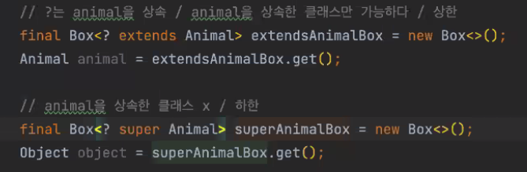

# item 31. 한정적 와일드카드를 사용해 API 유연성을 높이라

## 네오의 수업 돌아보기

네오의 제네릭 수업 중 나온 와일드카드 `?`



제네릭에서는 ?를 이용하여 자료형의 상한과 하한을 정할 수 있다.

- `? extends Animal` -> 제네릭으로 설정할 수 있는 타입이 Animal과 Animal을 상속한 하위 클래스만이 가능하다.
- `? super Animal` -> 제네릭으로 설정할 수 있는 타입이 Animal과 Animal이 구현하고있는 상위 클래스가 가능하다.

---

## 제네릭은 불공변!

또 다시 나온 [불공변](https://github.com/woowa-Effective-Java-Study/effective-java-study/blob/main/OzRagwort/item28.md#1-%EB%B0%B0%EC%97%B4%EC%9D%80-%EA%B3%B5%EB%B3%80%EC%9D%B4%EA%B3%A0-%EC%A0%9C%EB%84%A4%EB%A6%AD%EC%9D%80-%EB%B6%88%EA%B3%B5%EB%B3%80%EC%9D%B4%EB%8B%A4) 이란 무엇인가?

요약하면 Type1, Type2가 있을 때 `List<Type1>`, `List<Type2>` 는 서로 상하위 관계가 아니라는 의미.

```java
import java.util.ArrayList;

class Application {
    public static void main(String[] args) {
        List<Object> objectList = new ArrayList<>();
        List<Integer> integerList = new ArrayList<>();
        objectList.addAll(integerList); // <- 컴파일 에러
    }
}
```

## item 29에서 제네릭을 적용한 Stack에는 여전히 문제가 없을까?

Stack에 한번에 여러 요소를 push하기 위해 `pushAll()`메서드를 추가했다. 

```java
public static class Stack<E> {
    private Object[] elements;
    private int size = 0;
    private static final int DEFAULT_INITIAL_CAPACITY = 16;

    public Stack() {
        elements = new Object[DEFAULT_INITIAL_CAPACITY];
    }

    public void push(E e) {
        ensureCapacity();
        elements[size++] = e;
    }

    public void pushAll(Iterable<E> src) {
        for (E e : src) {
            push(e);
        }
    }

    public E pop() {
        if (size == 0)
            throw new EmptyStackException();

        @SuppressWarnings("unchecked")
        E result = (E) elements[--size];
        elements[size] = null;
        return result;
    }

    private void ensureCapacity() {
        if (elements.length == size)
            elements = Arrays.copyOf(elements, 2 * size);
    }
}
```

다음 코드가 실행된다면 문제가 없을까?

```java
public class Application {
    static class WootecoPeople {
        private final String name;
        WootecoPeople(String name) {
            this.name = name;
        }
    }
    static class Crew extends WootecoPeople {
        Crew(String name) {
            super(name);
        }
    }

    public static void main(String[] args) {
        Stack<WootecoPeople> people = new Stack<>();
        List<Crew> crews = toCrewList(List.of("eve", "beakara", "alex"));
        people.pushAll(crews);
    }

    private static List<Crew> toCrewList(List<String> crews) {
        return crews.stream()
                .map(Crew::new)
                .collect(Collectors.toList());
    }
}
```

여기서 발생하는 문제는?

1. 컴파일 에러
2. 런타임 에러
3. 에러가 없음

.

.

.

.

.

이 곳에서는 `people.pushAll(crews);`에서 컴파일 에러가 발생한다. 

그 이유는 `pushAll()`가 무조건 E 타입의 `Iterable<E>`를 받기 때문이다. 

위 코드에서 Crew는 WootecoPeople의 하위 클래스이지만 `Iterable<Crew>`와 `Iterable<WootecoPeople>`는 상하위 관계가 아닌 불공변 관계이다.

따라서 다른 타입을 파라미터로 준 것과 같다고 컴파일러가 인식한다.

이러한 문제를 해결할 때 와일드카드를 사용한다.

## 와일드카드로 제네릭 타입의 상하위 관계를 설정하기

다시 네오의 코드


- `? extends Animal` -> 제네릭으로 설정할 수 있는 타입이 Animal과 Animal을 상속한 하위 클래스만이 가능하다.
- `? super Animal` -> 제네릭으로 설정할 수 있는 타입이 Animal과 Animal이 구현하고있는 상위 클래스가 가능하다.

```java
class Stack<E> {
    public void pushAll(/*이곳에 들어갈 것은?*/) {
        for (E e : src) {
            push(e);
        }
    }
}
```

그렇다면 Crew는 WootecoPeople의 하위 클래스이고, `Iterable<E>`에서 WootecoPeople과 Crew 모두 받고 싶다면?

1. `Iterable<? extends E>`
2. `Iterable<? super E>`

답은 1번 `Iterable<? extends E>`

## 우리가 흔하게 사용하는 List 등에서도 적용되어 사용중이다.

```java
public class Application {

    static class WootecoPeople {
        private final String name;

        WootecoPeople(String name) {
            this.name = name;
        }
    }

    static class Crew extends WootecoPeople {
        Crew(String name) {
            super(name);
        }
    }

    public static void main(String[] args) {
        List<WootecoPeople> people = new ArrayList<>();
        List<Crew> crews = toCrewList(List.of("eve", "beakara", "alex"));
        people.addAll(crews);
        // ArrayList 실제 코드
        // public boolean addAll(Collection<? extends E> c) { ... }
    }

    private static List<Crew> toCrewList(List<String> crews) {
        return crews.stream()
                .map(Crew::new)
                .collect(Collectors.toList());
    }
}
```

## extends와 super를 언제 사용할 것인가?

질문 : pushAll(), addAll()은 왜 extends를 사용할까??

.

.

.

pushAll(), addAll()등은 `생산자(Producer)`이기 때문이다.

반대로 popAll()과 같은 `소비자(Consumer)`는 super를 사용한다.

```java
public class Stack<E> {
    public void pushAll(Iterable<? extends E> src) {
        for (E e : src) {
            push(e);
        }
    }
    
    public void popAll(Collection<? super E> dst) {
        while (!isEmpty()) {
            dst.add(pop());
        }
    }
}
```

왜 생산자와 소비자에 따라 extends와 super가 나뉠까?

다음 구조를 가진 상황이라고 가정한다.

- class People
- class WootecoPeople extends People
- class Crew extends WootecoPeople
- class BackendCrew extends Crew

`Stack<WootecoPeople> stack`이라는 스택이 있다.

생산자인 pushAll에서 `? super E`의 의미는 `? super WootecoPeople`이 된다. 즉 pushAll()은 WootecoPeople, People, Object형의 제네릭 타입만 올 수 있다.

그렇다면 우테코 사람이 아닌 일반인도 push할 수 있고 Object형인 다른 인스턴스도 push할 수 있다.

반대로 소비자에서 `? extends E`는 `? extends WootecoPeople`이 된다.

그러면 위 코드에서 dst 파라미터로 `Collection<BackendCrew>` 타입이 올 수 있다.

하지만 Stack에 저장된 데이터는 WootecoPeople 타입일 수 있는데 그런 경우 BackendCrew가 WootecoPeople의 하위 클래스이므로 dst에 저장할 수 없다.

이런 것을 생산자(Producer)는 Extends, 소비자(Consumer)는 Super를 쓰자를 줄여 Producer-Extends-Consumer-Super(PECS)라고도 한다.

### PECS 예시

item 30의 `max()`로 예를 들어본다.

item 30에서는 `public static <E extends Comparable<E>> E max(List<E> list)`로 설명한다.

이 메서드에 PECS를 적용하면 

`public static <E extends Comparable<? super E>> E max(List<? extends E> list)`가 된다.

`Comparable<E>`를 `Comparable<? super E>`로 수정하는 이유는 Comparable이 소비자이기 때문이다.

두 값을 비교해서 하나의 값을 내보내기 때문!

실제로 Comparable, Comparator 등은 `? super E`를 사용한다.

수많은 예시를 보고 싶다면 Stream 인터페이스를 확인해보자

---

### 와일드카드가 적용된 Stack 코드 저장용

```java
public static class Stack<E> {
    private Object[] elements;
    private int size = 0;
    private static final int DEFAULT_INITIAL_CAPACITY = 16;

    public Stack() {
        elements = new Object[DEFAULT_INITIAL_CAPACITY];
    }

    public void push(E e) {
        ensureCapacity();
        elements[size++] = e;
    }

    public void pushAll(Iterable<? extends E> src) {
        for (E e : src) {
            push(e);
        }
    }

    public E pop() {
        if (size == 0)
            throw new EmptyStackException();

        @SuppressWarnings("unchecked")
        E result = (E) elements[--size];
        elements[size] = null;
        return result;
    }

    private void ensureCapacity() {
        if (elements.length == size)
            elements = Arrays.copyOf(elements, 2 * size);
    }
}
```
